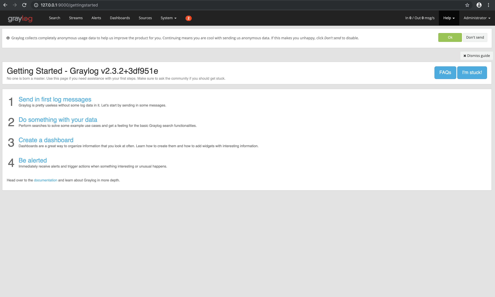
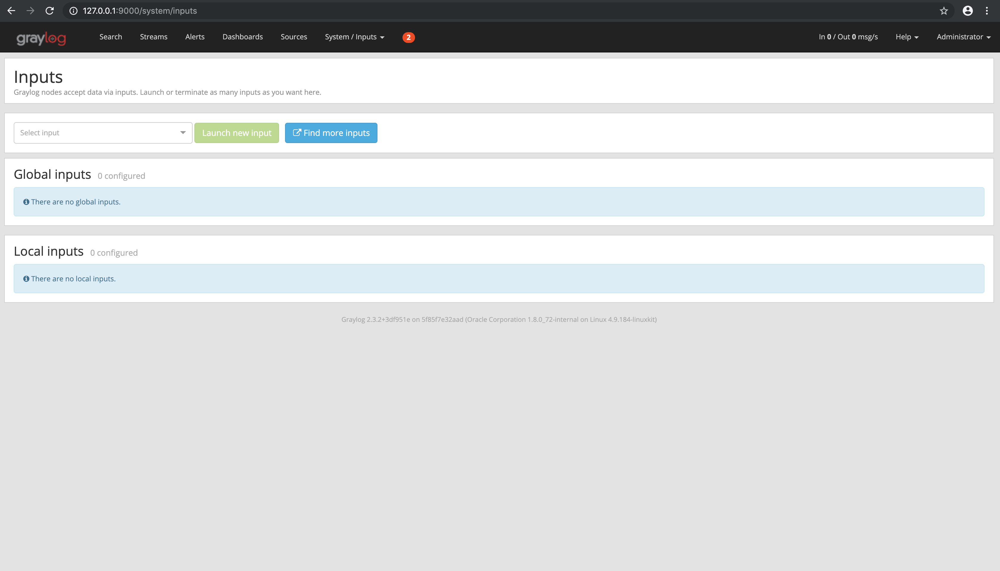
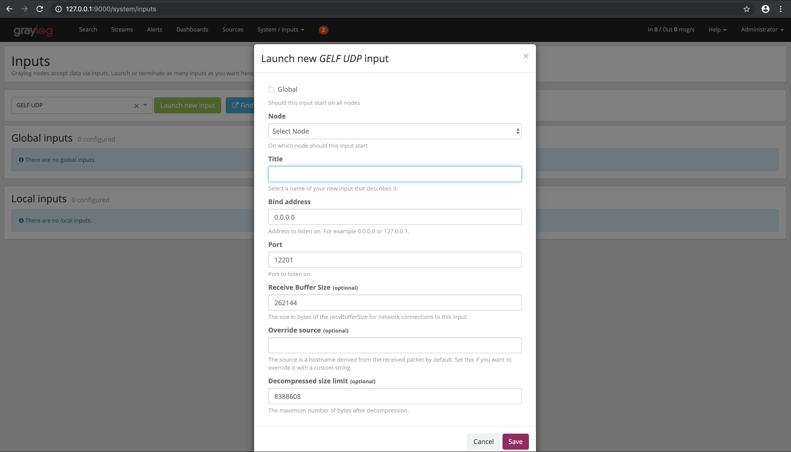
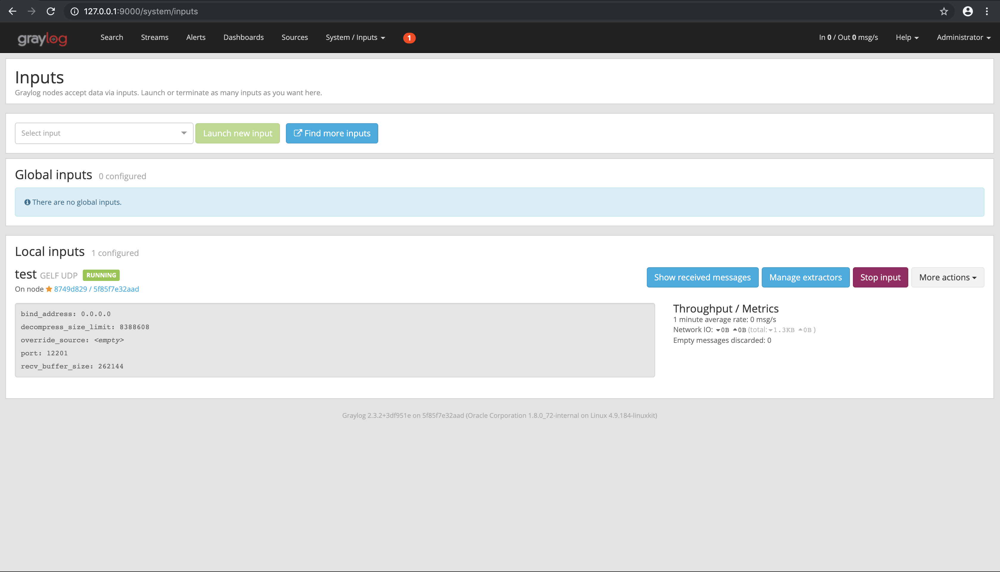
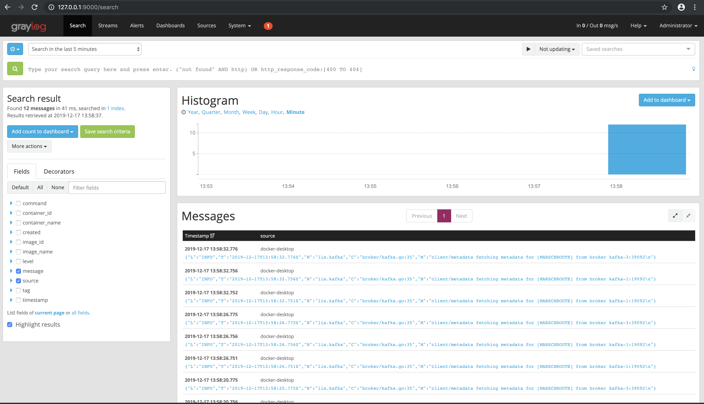
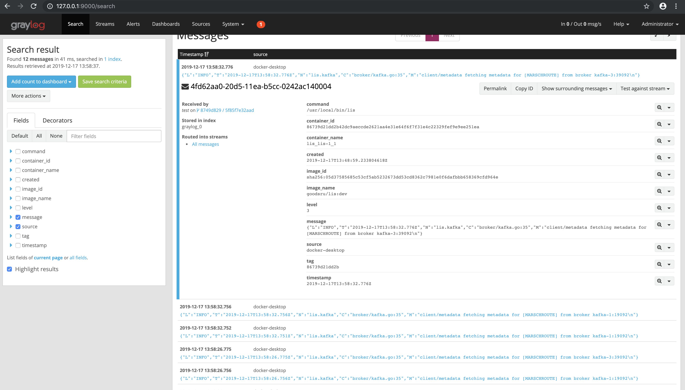
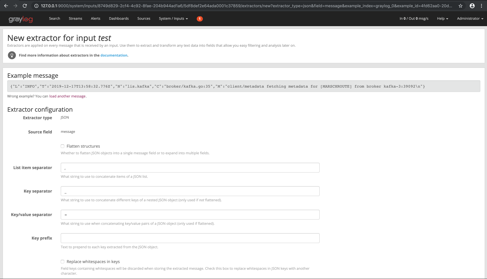
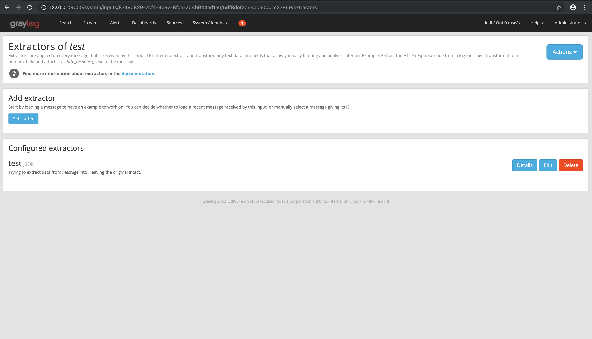

# App_Microservice

## Переменные окружения

Посмотреть доступные для конфигурирования переменные окружения их дефолтные значения и типы можно выполнив команду:
```bash
make env
```
или, если есть бинарник, вызвать его с флагом `--help`

### Web server
- APP_MICROSERVICE_WEBSERVER_VERSION
- APP_MICROSERVICE_WEBSERVER_HOST
- APP_MICROSERVICE_WEBSERVER_READ_TIMEOUT
- APP_MICROSERVICE_WEBSERVER_WRITE_TIMEOUT
- APP_MICROSERVICE_WEBSERVER_SHUTDOWN_TIMEOUT
- APP_MICROSERVICE_WEBSERVER_PORT

### Logger

- APP_MICROSERVICE_LOGGER_DEBUG
- APP_MICROSERVICE_LOGGER_LEVEL
- APP_MICROSERVICE_LOGGER_OUTPUT
- APP_MICROSERVICE_LOGGER_TIME_ENCODER

## Локальное окружение

1. С помощью термнала перейти в корень папки сервиса, скачанной из репозитория;
2. Выполнить команды:

```
make build     # сборка исполняемого бинарного файла
make docker    # сборка docker образа приложения
make dcup      # запуск всех контейнеров локального окружения
make dcgrayup  # запуск окружения с graylog 
```

Остановка всех контейнеров локального окружения:
```
make dcdown dcgraydown
```

Очистка локального окружения от предыдущих сборок (удаление неиспользуемых сборок и томов(volumes)):
```
make clean
```

## Интеграционные тесты
Перед запуском интеграционных тестов необходимо удостовериться что в регистре образ с текущим кодом системы, который 
нужно тестировать.
Для актуализации нужно использовать команду:
```
make build
make docker
```

Для запуска тестов в CI-режиме используется команда:
```
make inttest-ci
```
В случае успешного завершения тестов контейнеры успешно завершатся и удалятся. Если произошла ошибка, docker-compose 
возвращает код ответа не равный 0 и CI должен прерываться.
Для локального запуска тестов и отладки можно использовать команду:
```
make inttest-debug-up
```
Остановка всех контейнеров тестового окружения:
```
make inttest-debug-down
```

Запуск пересборки контейнера с интеграционными тестами и повторным запуском прохождения тестов:
```
make inttest-debug-restart-tests
```

## Трэйсинг

Трэйсы пишем в Jaeger, локально трэйсы можно посмотреть через Jaeger UI по адресу http://0.0.0.0:16686

## Настройка graylog2

 * Hostname: 127.0.0.1:9000 
 * Login/Password: admin - admin

1. В верхнем меню кликаем на [System]. 
2. В выпадающем меню [System] находим подраздел [Inputs] и кликаем на него.   
 
3. В выпадающем списке (Select input) выбираем [GELF UDP].

4. В выпадающем списке (Node) выбираем текущую ноду.

5. В поле Title указываем [test] или другой текст по желанию и нажимаем кнопку [Save].

6. В списке (Local Inputs) появился локальный адаптер. Нажимаем на кнопку [Show received messages].

7. Список сообщений. 

8. Нажимаем на любое сообщение и переходим к разделу [message]. Справа от сообщения находим выпадающее меню и кликаем на [Create extractor for fields] выбираем [JSON]. 

Заполняем поле Title и нажимаем на кнопку [Save].

Done!

"# app_microservice" 
